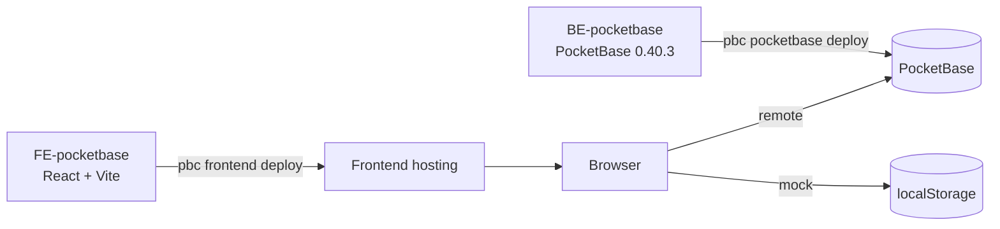

# PocketBase Cloud Template

Open-source **BE-PocketBase** + **FE-PocketBase** starter. Clone it, run it, ship it to [PocketBase Cloud](https://pocketbasecloud.com). Build fast, ship faster.

**Demo:** https://tkig0lbkjg56cwd.6j6t.pocketbasecloud.com · admin `admin@aura.test` / `secret123`



## Features

- Storefront, admin (products, journal, orders) and a setup wizard at `/admin/setup`
- Runs on demo data out of the box — no backend needed to try it
- Wizard connects to your instance, imports collections and seeds sample data
- One schema file (`collections.json`) → auto-generated PocketBase migrations

## Try the demo

1. Open [`/admin`](https://tkig0lbkjg56cwd.6j6t.pocketbasecloud.com/admin) and sign in with the demo account.
2. Go to **Setup** and follow the 3 steps: **Connect** your PocketBase URL → **Import collections** → **Seed sample data**.

## Quick start

Requires [Bun](https://bun.sh) and the `pbc` CLI.

```sh
git clone <this-repo-url> && cd PocketbaseCloud-Template
```

**Backend**

```sh
cd BE-pocketbase
pbc local init 0.40.3                                         # download PocketBase
./pocketbase superuser upsert admin@example.com yourpassword  # create admin
./pocketbase serve                                            # http://127.0.0.1:8090/_/
```

**Frontend** (new terminal, from the repo root)

```sh
cd FE-pocketbase
bun install
cp .env.example .env.local   # set VITE_USE_MOCK_POCKETBASE=false, VITE_POCKETBASE_URL=http://127.0.0.1:8090
bun run dev                  # http://localhost:3000
```

Then open http://localhost:3000/admin/setup to seed sample data.

## Deploy to PocketBase Cloud

```sh
pbc login
pbc whoami                  # verify account
pbc project ls              # list projects
pbc project use <project>   # pick one

(cd BE-pocketbase && pbc pocketbase deploy)   # deploy backend
(cd FE-pocketbase && pbc frontend deploy)     # deploy frontend
```

Get the dashboard URL, API URL and admin credentials with `pbc pocketbase info <name>`.

> `pbc.json` is created on first deploy and git-ignored. See `pbc.json.example`.
> Frontend env is baked at build time: edit `.env.production` before `pbc frontend deploy`.

## Change the schema

```sh
# edit FE-pocketbase/src/setup/collections.json, then:
cd FE-pocketbase && bun run sync:schema   # writes a new migration to BE-pocketbase/pb_migrations
```

## Project structure

```text
BE-pocketbase/   PocketBase hooks + migrations
FE-pocketbase/   React app, admin, setup wizard
  src/setup/     collections.json + setup logic
  scripts/       sync-schema, test helpers
```

## Scripts

```sh
bun run dev          # dev server
bun run build        # production build
bun run lint         # typecheck
bun test             # tests
bun run sync:schema  # generate migration
```
