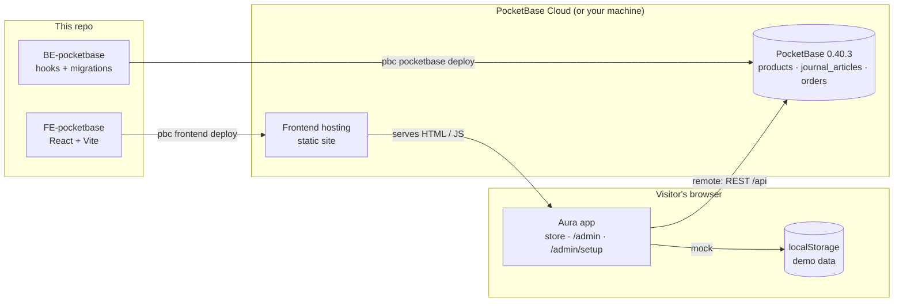
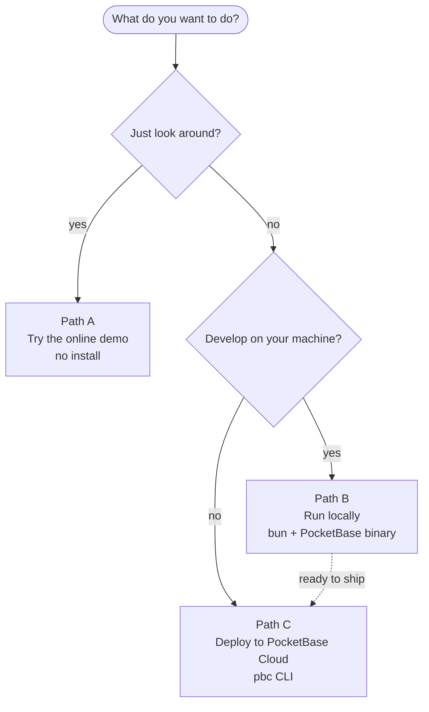
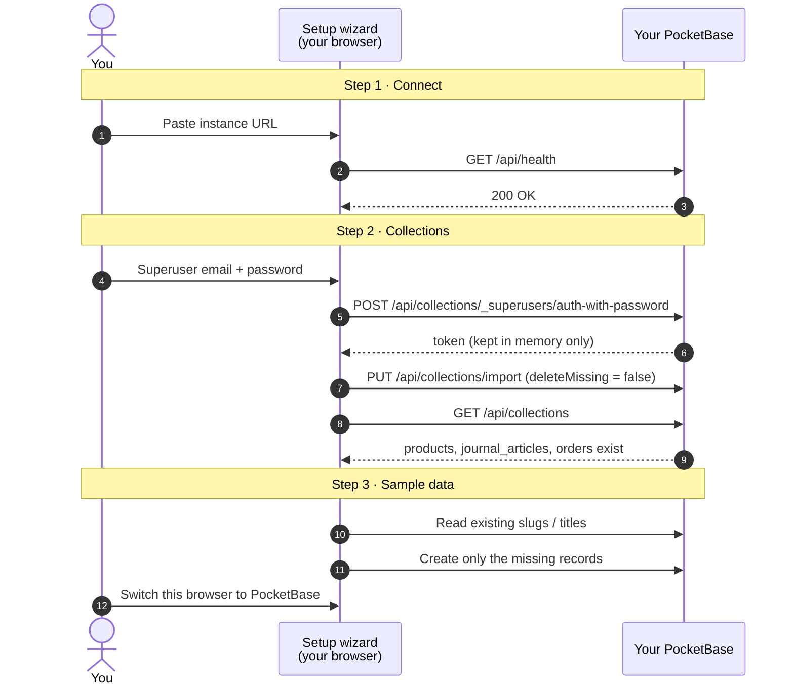
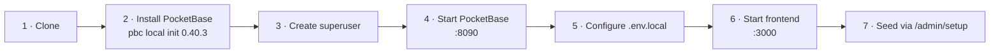
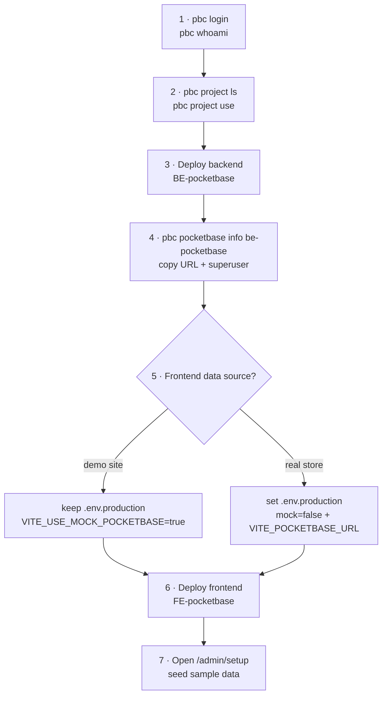
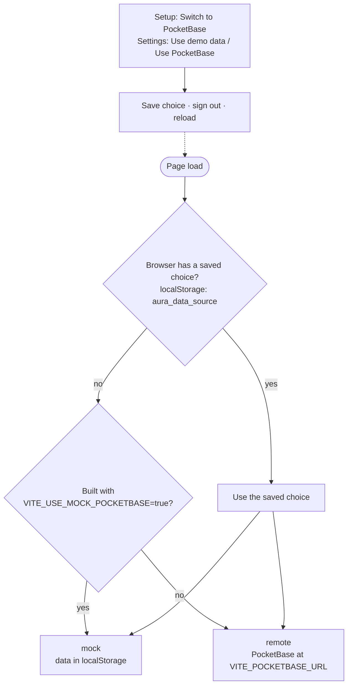
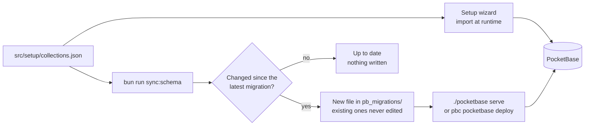

# PocketBase Cloud Template

A full-stack starter you can clone and ship: a **PocketBase** backend (`BE-pocketbase`) and a **React + Vite** storefront with an admin (`FE-pocketbase`), ready to run locally and deploy to [PocketBase Cloud](https://pocketbasecloud.com).

The frontend runs on demo data out of the box, so anyone can try it before creating a backend. When you're ready, a built-in setup wizard connects it to your own PocketBase instance, creates the collections, and seeds sample data.

**Live demo:** https://tkig0lbkjg56cwd.6j6t.pocketbasecloud.com · admin login `admin@aura.test` / `secret123`

## Contents

- [How it fits together](#how-it-fits-together)
- [Choose your path](#choose-your-path)
- [Prerequisites](#prerequisites)
- [Path A — Try the online demo](#path-a--try-the-online-demo)
- [Path B — Run everything locally](#path-b--run-everything-locally)
- [Path C — Deploy to PocketBase Cloud](#path-c--deploy-to-pocketbase-cloud)
- [Demo data vs. PocketBase](#demo-data-vs-pocketbase)
- [Changing the schema](#changing-the-schema)
- [Project structure](#project-structure)
- [Scripts](#scripts)
- [Troubleshooting](#troubleshooting)

## How it fits together



| Folder | What it is |
| --- | --- |
| `BE-pocketbase/` | PocketBase 0.40.3. Migrations create the `products`, `journal_articles` and `orders` collections on start. |
| `FE-pocketbase/` | Storefront (`/`), admin (`/admin`) and setup wizard (`/admin/setup`). |

## Choose your path



## Prerequisites

| Tool | Needed for | Check |
| --- | --- | --- |
| [Git](https://git-scm.com) | B, C | `git --version` |
| [Bun](https://bun.sh) 1.3+ | B, C | `bun --version` |
| `pbc` — the PocketBase Cloud CLI (tested with 0.8.5) | B (downloads PocketBase), C | `pbc --version` |

Path A needs only a browser.

## Path A — Try the online demo

1. Open the [demo](https://tkig0lbkjg56cwd.6j6t.pocketbasecloud.com) and browse the store.
2. Open [`/admin`](https://tkig0lbkjg56cwd.6j6t.pocketbasecloud.com/admin) and sign in with `admin@aura.test` / `secret123`.
   Everything you change is stored in your browser only.
3. Optional — connect the demo to **your own** PocketBase instance: go to **Setup** (`/admin/setup`) and follow the three steps.



Your superuser credentials go straight from your browser to your instance and are never stored. The import never deletes your other collections, and seeding skips records that already exist, so both are safe to run again.

## Path B — Run everything locally

You'll use two terminals: one for PocketBase, one for the frontend.



**1. Clone**

```sh
git clone <this-repo-url> PocketbaseCloud-Template
cd PocketbaseCloud-Template
```

**2. Install the PocketBase binary** (terminal 1)

```sh
cd BE-pocketbase
pbc local init 0.40.3
```

Pass the version explicitly — `pbc` does not read it from any config file. The binary is git-ignored, so every machine installs its own.

**3. Create a superuser**

```sh
./pocketbase superuser upsert admin@example.com yourpassword
```

**4. Start PocketBase**

```sh
./pocketbase serve
```

Expected: the dashboard at http://127.0.0.1:8090/_/. The migration in `pb_migrations/` has already created `products`, `journal_articles` and `orders`.

**5. Point the frontend at it** (terminal 2)

```sh
cd FE-pocketbase
bun install
cp .env.example .env.local
```

Edit `.env.local`:

```ini
VITE_USE_MOCK_POCKETBASE=false
VITE_POCKETBASE_URL=http://127.0.0.1:8090
```

**6. Start the frontend**

```sh
bun run dev
```

Expected: the store at http://localhost:3000. The collections are still empty, so it shows the built-in catalog for now.

**7. Seed sample data**

Open http://localhost:3000/admin/setup, use `http://127.0.0.1:8090` and the superuser from step 3. Step 2 will find the collections already exist — press **Check collections**, then **Seed sample data**. Sign in at http://localhost:3000/admin with the same superuser.

> Want to skip PocketBase entirely? Leave `VITE_USE_MOCK_POCKETBASE=true` and only run step 6. The admin login is then `admin@aura.test` / `secret123`.

## Path C — Deploy to PocketBase Cloud



**1. Log in**

```sh
pbc login        # opens the browser
pbc whoami       # verify the account
```

**2. Pick the project to deploy into**

```sh
pbc project ls
pbc project use <project>
```

**3. Deploy the backend**

```sh
cd BE-pocketbase
pbc pocketbase deploy --new be-pocketbase   # first time
pbc pocketbase deploy                       # every time after
```

The deploy ships `pb_hooks/` and `pb_migrations/`; migrations run on the restart that follows, so the collections exist right away.

**4. Get the URLs and credentials**

```sh
pbc pocketbase info be-pocketbase
```

A new instance gets a managed superuser. The password is printed once when the first deploy finishes and can be read here afterwards.

**5. Choose what the deployed frontend uses**

`VITE_*` variables are baked in at build time. Edit `FE-pocketbase/.env.production`:

| Goal | `.env.production` |
| --- | --- |
| Public demo on mock data | `VITE_USE_MOCK_POCKETBASE=true` (as shipped) |
| Store backed by your instance | `VITE_USE_MOCK_POCKETBASE=false`<br/>`VITE_POCKETBASE_URL=https://<your-instance>` |

**6. Deploy the frontend**

```sh
cd FE-pocketbase
pbc frontend deploy --new fe-pocketbase     # first time
pbc frontend deploy                         # every time after
```

`pbc` installs dependencies if needed, runs `bun run build` and uploads `dist/`. The site is served at `<id>.<compute>.pocketbasecloud.com`.

**7. Seed sample data** — open `https://<your-site>/admin/setup` and follow [the wizard](#path-a--try-the-online-demo).

### What you get

After deploying, `pbc pocketbase info <name>` and the Cloud dashboard show:

- **Admin dashboard URL** — `https://<instance>/_/`
- **API base URL** — `https://<instance>/api/`
- **Admin email / password** — the managed superuser
- **Deployments** — status of each deploy

### About `pbc.json`

`pbc` writes a `pbc.json` into each folder on the first deploy, linking it to **your** project and instance. It is git-ignored so your ids never end up in the repo. `pbc.json.example` shows the build settings `pbc` uses; copy it to `pbc.json` only if you want to set them before deploying.

## Demo data vs. PocketBase

The same build can run on demo data or on a real instance. The app decides on every page load:



Switching always signs you out: a demo session means nothing to a real server, and the other way round.

## Changing the schema

`FE-pocketbase/src/setup/collections.json` is the single source for all three collections. It reaches PocketBase in two ways that always produce the same result:



1. Edit `FE-pocketbase/src/setup/collections.json` — or change collections in a local dashboard and export them into that file.
2. Generate the migration:
   ```sh
   cd FE-pocketbase
   bun run sync:schema          # writes BE-pocketbase/pb_migrations/<timestamp>_aura_collections.js
   bun run sync:schema --check  # exits 1 if a migration is missing (useful in CI)
   ```
3. Update the field table in `src/constants/pocketbaseCollections.ts` (shown in Admin → Settings).
4. Commit, then restart PocketBase locally or run `pbc pocketbase deploy`.

### Access rules

| Collection | List / view | Create | Update / delete |
| --- | --- | --- | --- |
| `products` | Anyone | Superusers | Superusers |
| `journal_articles` | Anyone | Superusers | Superusers |
| `orders` | Superusers | Anyone (checkout) | Superusers |

## Project structure

```text
.
├── BE-pocketbase/
│   ├── pb_hooks/                 JavaScript hooks (*.pb.js, runs in goja — not Node)
│   ├── pb_migrations/            generated schema migrations, applied on start
│   ├── pbc.json.example          build settings for `pbc`
│   └── README.md
└── FE-pocketbase/
    ├── scripts/
    │   ├── sync-schema.mjs       collections.json → BE migration
    │   └── pb-scratch.sh         throwaway PocketBase for integration tests
    ├── src/
    │   ├── setup/                collections.json + setupApi.ts (wizard logic)
    │   ├── pages/admin/          admin pages, including SetupPage.tsx
    │   ├── components/admin/     admin UI, setup steps in setup/
    │   ├── services/pocketbase/  client, data source switch, mock layer, API calls
    │   └── constants/            demo catalog, articles, collection field table
    ├── .env.example / .env.production
    ├── pbc.json.example
    └── README.md
```

Git-ignored: `BE-pocketbase/pocketbase` (binary), `BE-pocketbase/pb_data/`, `pbc.json`, `.env.local`, `node_modules/`, `dist/`.

## Scripts

Run inside `FE-pocketbase/`:

| Command | What it does |
| --- | --- |
| `bun run dev` | Dev server on http://localhost:3000 |
| `bun run build` / `bun run preview` | Production build / serve it locally |
| `bun run lint` | Typecheck with `tsc` |
| `bun test` | Unit tests (integration tests are skipped unless `PB_TEST_URL` is set) |
| `bun run sync:schema [--check]` | Generate a backend migration from `collections.json` |

Integration tests against a disposable PocketBase:

```sh
cd FE-pocketbase
bash -c 'W=$(mktemp -d); scripts/pb-scratch.sh "$W" 8095'
PB_TEST_URL=http://127.0.0.1:8095 bun test src/setup/setupApi.integration.test.ts
```

## Troubleshooting

| Symptom | Fix |
| --- | --- |
| Setup says **"Can't reach this URL"** | Use the base URL without `/api/`, check the instance is running (`pbc pocketbase info <name>`), and use `https://` for Cloud. |
| Setup says **"Wrong superuser email or password"** | Read the managed credentials with `pbc pocketbase info <name>`, or locally run `./pocketbase superuser upsert <email> <password>`. |
| Admin header shows **Mock data** when you expected PocketBase | Admin → Settings → **Use PocketBase**, or finish the setup wizard. A saved browser choice beats the build setting. |
| Store shows the built-in catalog, not your records | The `products` collection is empty — seed it from `/admin/setup`. |
| `pbc` deploys to the wrong project or instance | Delete that folder's `pbc.json`, run `pbc project use <project>`, and deploy again with `--new <name>` or `--name <name>`. |
| `./pocketbase: No such file or directory` | The binary is per machine: `cd BE-pocketbase && pbc local init 0.40.3`. |
| `bun run sync:schema --check` fails | `collections.json` changed without a migration — run `bun run sync:schema` and commit the new file. |
